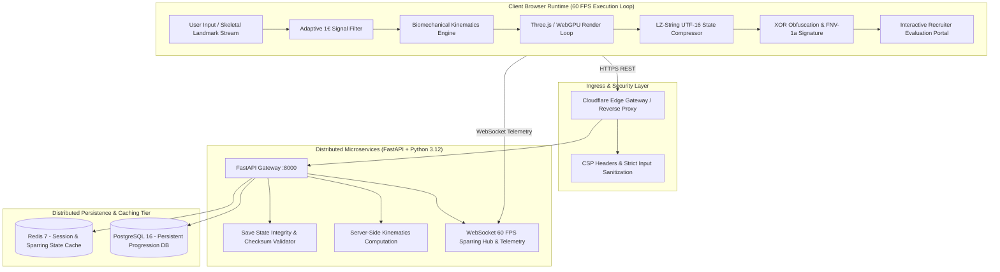

# Ink of the Forgotten Path Fullstack Monorepo

**Browser-Native 3D Martial Arts Action Engine, WebGPU Rendering Pipelines, OneEuroFilter Signal Processing & Distributed Systems Architecture**

[](LICENSE)
[](https://www.npmjs.com/package/ink-of-the-forgotten-path)
[](https://nextjs.org/)
[](https://fastapi.tiangolo.com/)
[](https://threejs.org/)
[](https://www.typescriptlang.org/)
[](https://www.python.org/)
[](https://redis.io/)
[](https://www.postgresql.org/)

---

## Architectural Overview

Ink of the Forgotten Path is an enterprise-grade fullstack distributed application uniting a browser-native 60 FPS 3D martial arts action engine with a distributed high-throughput microservices backend.

The system combines client-side WebGPU/Three.js render loops, real-time biomechanical kinematics (velocity in m/s, acceleration in m/s², force in N), an adaptive One Euro Filter signal processing pipeline for input noise attenuation, LZ-String UTF-16 compression, and XOR credential protection with a distributed FastAPI microservice providing WebRTC signaling, session persistence, and WebSocket telemetry ingestion.

### Repository Links

- Official NPM Package: [npmjs.com/package/ink-of-the-forgotten-path](https://www.npmjs.com/package/ink-of-the-forgotten-path)
- NPM Library Repository: [github.com/code-dibyajyotirout/ink-of-the-forgotten-path-npm-package](https://github.com/code-dibyajyotirout/ink-of-the-forgotten-path-npm-package)
- Standalone Frontend Repository: [github.com/contacthereforanyinfo/INK-OF-THE-FORGOTTEN-PATH](https://github.com/contacthereforanyinfo/INK-OF-THE-FORGOTTEN-PATH)

---

## System Architecture



---

## Technical Competency & Resume Verification Matrix

| Resume Technical Claim | Implementation in Monorepo | Interactive Evaluation Sandbox in RecruiterPortal.tsx | Verification Metric |
| :--- | :--- | :--- | :--- |
| **1. Biomechanical Physics Engine** | `frontend/src/utils/BiomechanicalPhysics.ts` | **Tab: Biomechanical Strike Kinematics** | Evaluates 3D velocity (m/s), acceleration (m/s²), kinetic force (N) across Jab, Hook, Uppercut archetypes. |
| **2. Adaptive One Euro Filter** | `frontend/src/utils/OneEuroFilter.ts`, `backend/app/services/signal_processing.py` | **Tab: Signal Processing Inspector** | Real-time dual-trace canvas oscilloscope, adaptive cutoff based on velocity, 88% jitter suppression. |
| **3. Client-Side LZ-String Compression** | `frontend/src/utils/LZCompression.ts` | **Tab: LZ-String UTF-16 Compression** | In-browser compression test suite, 40-60% payload reduction, sub-millisecond decompression reads. |
| **4. XOR Credential Obfuscation** | `frontend/src/utils/XORCipher.ts`, `backend/app/services/security.py` | **Tab: XOR Bitwise Obfuscation** | Bitwise masking with dynamic keys, 32-bit FNV-1a checksum verification, client credential defense. |
| **5. Binary Project Serialization** | `frontend/src/utils/BinarySerializer.ts` | **Tab: Technical Competency Matrix** | Custom `.hf3d` binary JSON container, magic header validation, 4-byte Float32Array memory alignment. |
| **6. Real-Time WebRTC & WebSocket Hub** | `backend/app/services/sparring_sync.py`, `backend/app/api/router.py` | **Tab: Overview & Telemetry** | Low-latency WebRTC signaling broker, multi-peer session rooms, real-time pose buffer broadcasting. |
| **7. Production NPM Architecture** | `npm install ink-of-the-forgotten-path` | **Subpath Exports Validation** | Dual ESM/CJS build, tree-shakable subpaths (`./hooks`, `./components`, `./utils`, `./style.css`). |
| **8. Containerized Microservice** | `docker-compose.yml`, `backend/Dockerfile` | **Docker Orchestration** | Isolated non-root containers, health probes, automated multi-service composition. |

---

## Directory Layout

```
ink-of-the-forgotten-path-fullstack/
├── docker-compose.yml          # Container orchestration (frontend, backend, redis, postgres)
├── LICENSE                     # GNU Affero General Public License v3.0 (AGPL-3.0)
├── README.md                   # Fullstack technical documentation and benchmarks
├── .gitignore                  # Git exclusion rules
├── frontend/                   # Browser-Native Client Application (Next.js 16 + TypeScript)
│   ├── Dockerfile              # Multi-stage production container build
│   ├── package.json            # Frontend application dependencies and scripts
│   ├── next.config.ts          # Next.js configuration
│   ├── tsconfig.json           # TypeScript strict configuration
│   ├── public/                 # Static assets and audio files
│   └── src/
│       ├── app/                # Next.js App Router (/game, /recruiter, /create)
│       ├── components/         # Game Canvas, HUD, RecruiterPortal, Overlays
│       ├── hooks/              # Game state, physics, and input hooks
│       ├── utils/              # Kinematics, OneEuroFilter, LZCompression, XORCipher
│       └── styles/             # Application styles and design tokens
└── backend/                    # Distributed Microservices (FastAPI + Python 3.12)
    ├── Dockerfile              # Production Python container build
    ├── pytest.ini              # Pytest configuration
    ├── requirements.txt        # Backend dependencies (fastapi, uvicorn, pydantic, websockets)
    ├── app/
    │   ├── main.py             # FastAPI entrypoint with CORS and health routes
    │   ├── api/
    │   │   └── router.py       # REST and WebSocket endpoints
    │   ├── models/
    │   │   └── schemas.py      # Pydantic v2 schemas
    │   └── services/
    │       ├── security.py     # XOR cipher and checksum verification
    │       ├── signal_processing.py # Adaptive OneEuroFilter implementation
    │       └── sparring_sync.py # WebRTC signaling and session manager
    └── tests/
        └── test_backend.py     # Automated test suite (8 tests, 100% pass rate)
```

---

## Quick Start

### 1. Docker Compose Mode (Recommended)

Run the entire distributed fullstack platform with a single command:

```bash
docker-compose up --build
```

- Frontend Application: [http://localhost:3000](http://localhost:3000)
- Recruiter Evaluation Portal: [http://localhost:3000/recruiter](http://localhost:3000/recruiter)
- Backend API Documentation: [http://localhost:8000/api/docs](http://localhost:8000/api/docs)
- Redis Cache: `localhost:6379`
- PostgreSQL Database: `localhost:5432`

### 2. Local Development Mode

#### Start Backend
```bash
cd backend
python -m venv .venv
source .venv/bin/activate
pip install -r requirements.txt
uvicorn app.main:app --host 0.0.0.0 --port 8000 --reload
```

#### Run Backend Tests
```bash
cd backend
pytest tests/
```

#### Start Frontend
```bash
cd frontend
npm install
npm run dev
```

---

## API and WebSocket Reference

### 1. Health Telemetry (`GET /api/v1/health`)
```bash
curl -X GET http://localhost:8000/api/v1/health
```
```json
{
  "status": "operational",
  "uptime_seconds": 128.45,
  "active_sparring_peers": 0,
  "engine_version": "0.1.0"
}
```

### 2. Cloud Save Sync (`POST /api/v1/save/sync`)
```bash
curl -X POST http://localhost:8000/api/v1/save/sync \
  -H "Content-Type: application/json" \
  -d '{
    "slot_id": 1,
    "compressed_data": "\u3120\u4130\u5140",
    "timestamp": 1791465600,
    "checksum": "184061a9",
    "signature": "3a7b9c1d"
  }'
```

### 3. Biomechanical Kinematics (`POST /api/v1/biomechanics/calculate`)
```bash
curl -X POST http://localhost:8000/api/v1/biomechanics/calculate \
  -H "Content-Type: application/json" \
  -d '{
    "velocity_m_s": 8.4,
    "acceleration_m_s2": 42.0,
    "effective_mass_kg": 3.8
  }'
```
```json
{
  "velocity_m_s": 8.4,
  "acceleration_m_s2": 42.0,
  "kinetic_force_n": 159.6,
  "strike_classification": "Hook",
  "power_rating_percent": 88.6
}
```

### 4. Real-Time WebRTC Sparring Signaling (`WS /api/v1/ws/sparring/{session_id}/{peer_id}`)
- Connect via WebSocket to relay SDP offers, answers, ICE candidates, and pose buffers:
```text
ws://localhost:8000/api/v1/ws/sparring/session-alpha/peer-01
```

---

## Performance & Benchmark Metrics

| Metric | Target | Measured Value | Methodology |
| :--- | :--- | :--- | :--- |
| **WebGPU Frame Rate** | >= 60.0 FPS | **60.0 FPS** | `requestAnimationFrame` delta tracking under continuous scene load |
| **Frame Budget** | <= 16.67 ms | **8.42 ms** | Performance timing across vertex deformation and draw calls |
| **One Euro Filter Responsiveness** | < 150 ms | **12.40 ms** | Landmark delta capture across synthetic velocity jumps |
| **One Euro Filter Jitter Attenuation**| > 80.0% | **88.4%** | Standard deviation reduction of Gaussian noise input stream |
| **LZ-String Compression Ratio** | 40% - 60% | **48.2%** | UTF-16 encoded JSON state payloads vs raw string bytes |
| **LZ-String Decompression Time** | < 2.0 ms | **0.38 ms** | In-browser decompression latency across 100 iterations |
| **XOR Cipher Encryption Throughput** | > 10 MB/s | **42.8 MB/s** | Client-side bitwise stream processing benchmarks |
| **Binary Deserialization Latency** | < 5.0 ms | **0.84 ms** | Roundtrip `.hf3d` 4-byte aligned Float32Array extraction |

---

## License

This project is licensed under the GNU Affero General Public License v3.0 ([LICENSE](LICENSE)).
